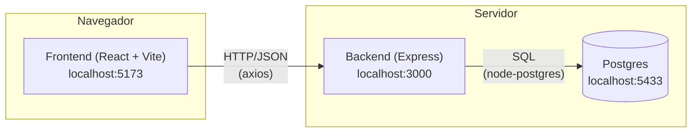
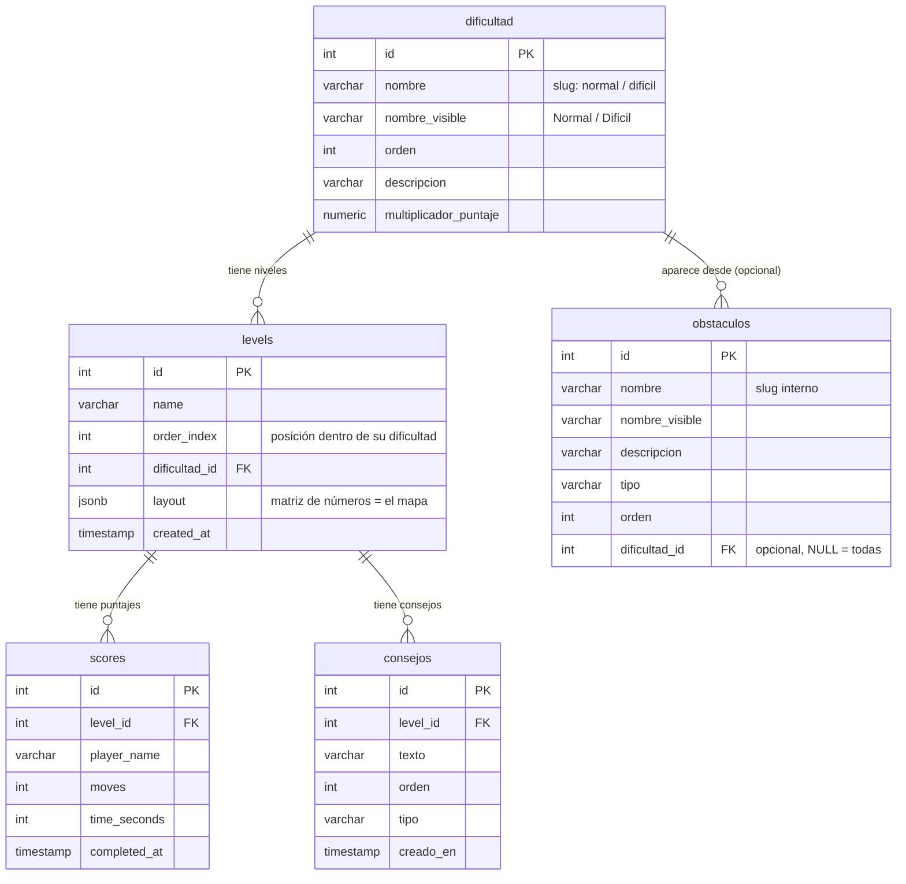

# Guía completa del proyecto — Cube of Stars

Esta guía explica **todo el código del proyecto**, de punta a punta, pensada
para alguien que nunca tocó este repositorio: qué hace cada pieza, por qué
está hecha así, y cómo se conectan el frontend, el backend, la base de datos
y Docker entre sí. No hace falta saber nada de este proyecto en particular
para seguirla — sí ayuda saber JavaScript básico y qué es una API REST.

Los otros documentos del repo (`README.md`, `backend/README.md`,
`frontend/README.md`, `db/README.md`, `ENDPOINTS.MD`) son más cortos y sirven
como referencia rápida. Esta guía es la versión larga: explica el *por qué*
y el *cómo*, no solo el *qué*.

## Índice

1. [Qué es Cube of Stars](#1-qué-es-cube-of-stars)
2. [Panorama general: las 3 piezas](#2-panorama-general-las-3-piezas)
3. [Docker: cómo se levanta todo](#3-docker-cómo-se-levanta-todo)
4. [La base de datos, a fondo](#4-la-base-de-datos-a-fondo)
5. [El backend, a fondo](#5-el-backend-a-fondo)
6. [El frontend, a fondo](#6-el-frontend-a-fondo)
7. [Una partida completa, de principio a fin](#7-una-partida-completa-de-principio-a-fin)
8. [Cómo hacer cambios comunes](#8-cómo-hacer-cambios-comunes)
9. [Glosario de términos del proyecto](#9-glosario-de-términos-del-proyecto)
10. [Errores comunes y cómo resolverlos](#10-errores-comunes-y-cómo-resolverlos)
11. [Índice de archivos: qué hace cada uno](#11-índice-de-archivos-qué-hace-cada-uno)

---

## 1. Qué es Cube of Stars

Es un juego de puzzle por casillas (estilo Sokoban/Chip's Challenge): un
cubo se mueve por un tablero en grilla tratando de llegar a la meta,
esquivando o usando a su favor mecánicas como lava, pinchos, láseres,
puertas (con botón, con placa de presión, o con llave), un puente que
colapsa con el tiempo, y "pickups" que dan poderes temporales (fantasma,
invulnerabilidad, fuerza). Hay 36 niveles repartidos en dos dificultades
(Normal y Difícil), con música, efectos de sonido, un glosario de mecánicas
dentro del juego, consejos progresivos por nivel, y una tabla de puntajes
que guarda cada partida completada (movimientos + tiempo).

Es un trabajo práctico universitario: el objetivo no es solo que el juego
funcione, sino demostrar el manejo de una arquitectura de 3 capas
(frontend / backend / base de datos) con Docker orquestando todo.

---

## 2. Panorama general: las 3 piezas



**La regla más importante de toda la arquitectura**: el backend **no sabe
jugar**. No tiene ni un renglón de lógica de juego (no sabe qué es "chocar
contra una pared" ni "morir en la lava"). El backend es un CRUD tonto: guarda
y devuelve niveles, dificultades, puntajes, consejos y un glosario de
mecánicas. Toda la partida — cada movimiento, cada mecánica, cada muerte —
se calcula **en el navegador**, en el frontend, con una función pura de
JavaScript. El backend solo se entera de dos cosas por partida: qué nivel
pediste al empezar (`GET /api/niveles/:id`) y qué puntaje sacaste al ganar
(`POST /api/puntajes`). En el medio, el backend no tiene ni idea de que
estás jugando.

Esto es una decisión de diseño, no un accidente: simplifica muchísimo el
backend (no hay que sincronizar estado de partida entre cliente y servidor,
no hay problemas de latencia moviendo al personaje) a cambio de que
"técnicamente" alguien podría hacer trampa editando el JavaScript del
navegador antes de mandar el puntaje. Para un TP universitario sin usuarios
reales ni dinero de por medio, ese trade-off es razonable.

### Las 3 piezas, una por una

- **`frontend/`** — Una SPA (Single Page Application) hecha con React. Es
  donde vive el 90% de la lógica del proyecto: el motor del juego, el
  renderizado del tablero, las animaciones, la música. Corre en el
  navegador del jugador.
- **`backend/`** — Una API REST hecha con Node.js + Express. Sin sesiones,
  sin login, sin estado propio: cada pedido HTTP se resuelve consultando o
  escribiendo en Postgres y devolviendo JSON. No guarda nada en memoria
  entre pedidos.
- **`db/`** — Un único archivo, `init.sql`, con el esquema completo
  (5 tablas) y los datos de partida (36 niveles, glosario de 18 mecánicas,
  consejos de los primeros 6 niveles). Postgres lo corre automáticamente la
  primera vez que se crea la base (más detalle en la sección 4).

Todo esto se levanta junto con **Docker Compose** (`docker-compose.yml` en
la raíz), que define y conecta los 3 servicios (`db`, `backend`,
`frontend`) sin que tengas que instalar Postgres o Node a mano.

---

## 3. Docker: cómo se levanta todo

### 3.1. Los 3 servicios de `docker-compose.yml`

```yaml
services:
  db:
    image: postgres:16
    ports: ["5433:5432"]
    volumes:
      - pgdata:/var/lib/postgresql/data
      - ./db/init.sql:/docker-entrypoint-initdb.d/init.sql
    healthcheck: ...
  backend:
    build: ./backend
    ports: ["3000:3000"]
    depends_on:
      db: { condition: service_healthy }
  frontend:
    build: ./frontend
    ports: ["5173:5173"]
    depends_on: [backend]
volumes:
  pgdata:
```

- **`db`** usa la imagen oficial `postgres:16` (no hace falta un
  `Dockerfile` propio, Postgres ya sabe arrancarse solo). Expone el puerto
  `5433` de tu máquina hacia el `5432` de adentro del contenedor (así no
  choca si ya tenés un Postgres local escuchando en el 5432 real).
- **`backend`** y **`frontend`** sí tienen su propio `Dockerfile`
  (`backend/Dockerfile`, `frontend/dockerfile`) porque hay que instalar
  dependencias (`npm install`) antes de poder correrlos.
- **`pgdata`** es un *volumen con nombre*: una carpeta que Docker gestiona
  por fuera de los contenedores, para que los datos de Postgres sobrevivan
  aunque el contenedor se recree (por ejemplo, con `docker compose up
  --build`). Solo se borra con `docker compose down -v` (la `-v` es la que
  borra volúmenes).

### 3.2. Cómo levantarlo

```bash
git clone <repo>
cd TP-Final-Introducci-n-desarrollo-software
docker compose up --build
```

Con eso ya tenés los 3 servicios corriendo: `http://localhost:5173` (juego),
`http://localhost:3000` (API), Postgres en el puerto `5433`. `--build`
fuerza a reconstruir las imágenes de `backend`/`frontend` (necesario la
primera vez, y cada vez que cambia código — ver el punto 3.4).

Para tocar solo un servicio: `docker compose up --build backend`,
`docker compose up --build frontend`, etc. — Compose entiende que los otros
ya están corriendo y no los toca.

### 3.3. `init.sql` solo corre UNA VEZ — la trampa más común

Esto es la causa del 80% de los "¿por qué en mi compu no aparecen los
niveles nuevos?": la imagen oficial de Postgres ejecuta automáticamente
cualquier script en `/docker-entrypoint-initdb.d/` (ahí está montado
`db/init.sql`, ver el `volumes:` de arriba) **solo si el volumen de datos
está vacío** — es decir, únicamente la primerísima vez que se crea el
volumen `pgdata`.

Una vez que `pgdata` ya tiene una base de Postgres inicializada adentro,
Postgres **no vuelve a mirar `init.sql` nunca más**, así hagas `git pull` y
el archivo tenga niveles nuevos. El volumen "recuerda" los datos viejos con
los que se creó, para siempre, hasta que alguien lo borre.

**Si cambiaste `init.sql` (o bajaste una versión nueva) y necesitás que se
vuelva a correr:**

```bash
docker compose down -v   # -v borra también los volúmenes (pierde los datos actuales)
docker compose up --build
```

### 3.4. `COPY . .` — la otra trampa común: hay que reconstruir, no reiniciar

Mirá el `Dockerfile` de cualquiera de los dos servicios de Node:

```dockerfile
FROM node:20-alpine
WORKDIR /app
COPY package*.json ./
RUN npm install
COPY . .              # <- copia el código UNA VEZ, al momento de construir la imagen
EXPOSE 3000
CMD ["npm", "run", "dev"]
```

No hay ningún `volumes:` en `docker-compose.yml` que monte
`./frontend` o `./backend` dentro del contenedor. Eso significa que el
código que corre adentro del contenedor es una **copia congelada** de cómo
estaba tu carpeta en el momento en que se construyó la imagen. Si editás un
archivo `.jsx` o `.js` después, el contenedor que ya está corriendo **no se
entera** — sigue sirviendo la copia vieja.

- `docker compose restart backend` → **no alcanza**, reinicia el proceso
  pero con el código viejo ya copiado adentro.
- `docker compose up --build backend` (o `frontend`) → **sí aplica el
  cambio**, porque reconstruye la imagen copiando el código actual.

Regla simple: **cualquier cambio de código real necesita `--build`.** Solo
podés saltearte el rebuild si estás corriendo el frontend/backend en modo
desarrollo nativo (fuera de Docker, con `npm run dev` directo en tu máquina)
apuntando a la base en Docker — ver el `README.md` raíz, sección "Modo
desarrollo".

### 3.5. El `healthcheck` de `db` y por qué existe

```yaml
healthcheck:
  test: ["CMD-SHELL", "pg_isready -U postgres -d puzzle_game"]
  interval: 2s
  timeout: 3s
  retries: 20
backend:
  depends_on:
    db:
      condition: service_healthy
```

`depends_on` sin `condition` solo espera a que el **contenedor** de `db`
arranque — no a que Postgres esté realmente listo para aceptar conexiones
(la primera vez, correr `init.sql` entero puede tardar varios segundos).
Sin el healthcheck, el `backend` podía arrancar antes de tiempo, fallar la
conexión, y con `restart: on-failure` entrar en un bucle de crash-reinicio
hasta que Postgres terminaba de levantar. `condition: service_healthy`
hace que Compose espere a que el `healthcheck` de `db` (que corre
`pg_isready`, un chequeo real de Postgres) devuelva OK antes de arrancar el
backend.

---

## 4. La base de datos, a fondo

Todo vive en un solo archivo: **`db/init.sql`**. No hay migraciones ni
carpeta de esquemas separados — es intencionalmente simple para un TP.
Estructura del archivo (los comentarios `--1.`, `--2.`, etc. son marcadores
para navegarlo rápido):

```
--1. dificultad
--2. niveles     (tabla levels)
--3. puntuaciones (tabla scores)
--4. consejos
--5. obstaculos
```

### 4.1. Diagrama de relaciones



### 4.2. Tabla por tabla

**`dificultad`** — Dos filas nada más: `normal` y `dificil`. `nombre` es el
slug en minúsculas que viaja por toda la API (`?dificultad=normal`);
`nombre_visible` es el texto que se muestra en pantalla ("Normal",
"Dificil"). `multiplicador_puntaje` está pensado para un futuro sistema de
puntaje ponderado por dificultad (hoy no se usa en ningún lado).

**`levels`** — Los niveles del juego. Lo más importante es la columna
`layout`, tipo `JSONB` (JSON binario, el tipo nativo de Postgres para
guardar JSON de forma eficiente y consultable): es una matriz de números,
un array de arrays donde cada número representa qué hay en esa celda del
mapa (0 = piso, 1 = pared, 2 = posición inicial del jugador, 3 = meta,
etc. — la lista completa está en la sección 6.4). `order_index` define en
qué posición aparece el nivel dentro de su dificultad — el frontend no usa
el `id` de la fila para numerar los botones "Nivel 1, 2, 3...", usa la
posición dentro de la lista ya ordenada por `order_index` (si usara el
`id`, los niveles difíciles — que tienen ids más altos porque se cargaron
después — arrancarían mostrando "21" en vez de "1").

Hoy la base tiene 36 niveles: 20 Normal (`order_index` 1-20), 15 Difícil
(21-35), y un nivel 36 especial ("Sala de Mecánicas") que no es un nivel de
diseño sino un cuarto de prueba con las 18 mecánicas juntas, para poder
probarlas todas sin buscarlas repartidas entre los 35 niveles reales.

**`scores`** (expuesta por la API como `/api/puntajes`, ver más abajo por
qué el nombre no coincide) — Un puntaje por partida ganada: quién jugó
(`player_name`), cuántos movimientos hizo, cuánto tardó
(`time_seconds`), y a qué nivel corresponde (`level_id`, con
`ON DELETE CASCADE`: si se borra un nivel, se borran solos todos sus
puntajes). No tiene columna de dificultad propia — se saca haciendo `JOIN`
con `levels` cuando hace falta, porque un puntaje siempre pertenece a un
nivel, y un nivel siempre tiene una sola dificultad fija.

**`consejos`** — Pistas progresivas por nivel (reemplazó a una tabla vieja
llamada `pistas`). El frontend pide **todos** los consejos de un nivel de
una sola vez (`GET /api/consejos?nivel=X`, ya vienen ordenados por
`orden`) y los va revelando de a uno en el navegador cuando el jugador
aprieta "Ver siguiente consejo" — no hay un pedido HTTP por cada consejo
que se revela. Por eso no existe una columna "veces visto": no hace falta
que el backend sepa cuántos pidió el jugador, eso se lleva en memoria del
lado del cliente (ver `useConsejos.js` en la sección 6). Solo hay consejos
cargados para los niveles 1 a 6 — el resto todavía no tiene.

**`obstaculos`** — El glosario de mecánicas que se muestra en el modal
"Cómo Jugar → Mecánicas" del juego (reemplazó a una tabla vieja llamada
`powerups`, que nunca se llegó a usar desde el frontend). Una fila por cada
mecánica implementada (piso, pared, lava, láser, puerta con llave, etc.),
con su nombre visible y su descripción — así ese modal arma su lista con
datos reales de la base en vez de tener el texto hardcodeado en el
JavaScript del frontend.

### 4.3. ¿Por qué "puntuaciones"/`scores` y no "`puntajes`" directamente?

Es un detalle de convención que vale la pena explicar porque puede
confundir: la tabla de Postgres se llama `scores` (nombre viejo, en
inglés), pero **todas las rutas y respuestas de la API están en español**
(`/api/puntajes`, con campos `jugador`/`movimientos`/`tiempo`). La
traducción pasa en las queries del backend, con `AS`:

```sql
SELECT id, level_id AS nivel, player_name AS jugador,
       moves AS movimientos, time_seconds AS tiempo, completed_at
FROM scores WHERE id = $1
```

Lo mismo pasa con `levels` (tabla) vs. `/api/niveles` (ruta) — es
intencional: nunca se renombraron las tablas originales, pero el "contrato"
de la API hacia el frontend quedó unificado en español. Más sobre esto en
la sección 5.4.

---

## 5. El backend, a fondo

### 5.1. Estructura de carpetas

```
backend/src/
├── index.js                    # arranque del servidor
├── db/
│   ├── pool.js                 # conexión a Postgres
│   └── queries/                # una función por operación SQL, agrupadas por tabla
│       ├── index.js
│       ├── dificultad.queries.js
│       ├── levels.queries.js
│       ├── puntajes.queries.js
│       ├── consejos.queries.js
│       └── obstaculos.queries.js
└── routes/                     # un archivo por recurso, define los endpoints HTTP
    ├── index.js
    ├── dificultad.routes.js
    ├── levels.routes.js
    ├── puntajes.routes.js
    ├── consejos.routes.js
    └── obstaculos.routes.js
```

La separación **`routes/` vs. `db/queries/`** es el patrón que se repite en
las 5 entidades: `routes/*.routes.js` se encarga de HTTP (leer
`req.query`/`req.body`, validar que los datos vengan bien, elegir el
código de estado de la respuesta) y **nunca** escribe SQL directamente;
`db/queries/*.queries.js` se encarga de hablarle a Postgres (siempre con
queries parametrizadas — `$1`, `$2`, nunca concatenando strings, para evitar
inyección SQL) y no sabe nada de HTTP. Un archivo de rutas nunca importa
`pg` directamente; siempre pasa por `db/queries`.

### 5.2. `index.js`: cómo arranca el servidor

```js
const app = express()
app.use(cors())
app.use(express.json())
app.use('/api', require('./routes'))

pool.query('SELECT 1')
  .then(() => app.listen(PORT, () => console.log(...)))
  .catch((err) => {
    console.error('❌ No se pudo conectar a Postgres:', err.message)
    process.exit(1)
  })
```

Antes de levantar el servidor HTTP, hace una query de prueba (`SELECT 1`)
para confirmar que Postgres responde. Si falla, corta el proceso con un
mensaje explicando las causas más comunes (falta el archivo `.env`, o
Postgres no está corriendo) en vez de levantar un servidor que va a fallar
en el primer pedido real igual.

### 5.3. `db/pool.js`: el detalle que rompió el proyecto una vez

```js
const pool = new Pool({ host: ..., port: ..., user: ..., password: ..., database: ... })

pool.on('error', (err) => {
  console.error('❌ Error inesperado en un cliente inactivo del pool de Postgres:', err.message)
})
```

Un "pool" es un conjunto de conexiones a Postgres reutilizables — en vez de
abrir y cerrar una conexión nueva por cada query (lento), `pg` mantiene
varias abiertas y las reparte entre los pedidos que van llegando.

El `pool.on('error', ...)` de acá arriba **no es opcional**: si una
conexión del pool que está inactiva en ese momento pierde la conexión con
Postgres (por ejemplo, el contenedor de la base reiniciando), Node emite un
evento `'error'` a nivel de *proceso*. Si nadie lo escucha, Node lo trata
como una excepción no capturada y **tira abajo todo el servidor**, cortando
cualquier pedido que estuviera en curso sin mandar respuesta (el navegador
lo ve como `net::ERR_EMPTY_RESPONSE`, una respuesta vacía sin ni siquiera un
código de error). Este listener simplemente loguea el error — el pool ya
reemplaza solo la conexión rota, no hace falta ninguna acción más.

### 5.4. El "contrato" de la API: todo en español, con alias viejos

`backend/src/routes/index.js`:

```js
router.use('/dificultad', require('./dificultad.routes'))
router.use('/dificultades', require('./dificultad.routes'))   // alias

router.use('/levels', require('./levels.routes'))
router.use('/niveles', require('./levels.routes'))             // alias

router.use('/puntajes', require('./puntajes.routes'))
router.use('/consejos', require('./consejos.routes'))
router.use('/obstaculos', require('./obstaculos.routes'))
```

`/dificultades`, `/niveles` y `/puntajes` son las rutas "canónicas" que usa
el frontend de verdad (ver `ENDPOINTS.MD` para el detalle completo de cada
una, con ejemplos de request/response). `/dificultad` y `/levels` quedan
como alias en inglés por compatibilidad con código viejo, pero apuntan
exactamente al mismo router — no hay lógica duplicada.

Cada endpoint devuelve el JSON ya "traducido" a nombres en español
(`nivel`, `jugador`, `movimientos`, `tiempo`, etc.), aunque las columnas de
Postgres por debajo tengan otro nombre (`level_id`, `player_name`, `moves`,
`time_seconds`) — la traducción vive en el `SELECT ... AS ...` de cada
query (ver el ejemplo de la sección 4.3).

### 5.5. Recorrido completo de un pedido real: `GET /api/niveles/5`

Para entender cómo se conectan todas las piezas del backend, sigamos un
pedido real de principio a fin:

1. El frontend hace `api.get('/api/niveles/5')` (con axios, desde
   `nivelServicio.js`).
2. Express recibe el pedido en `/api/niveles/5`. `routes/index.js` lo
   redirige a `levels.routes.js` (`router.use('/niveles', ...)`).
3. Dentro de `levels.routes.js`, matchea `router.get('/:id', ...)` con
   `req.params.id = "5"`.
4. Llama a `levels.getLevelById("5")`, definida en
   `db/queries/levels.queries.js`:
   ```js
   const { rows } = await pool.query(
     `SELECT l.id, l.name AS nombre, d.nombre AS dificultad, l.layout AS mapa
      FROM levels l
      LEFT JOIN dificultad d ON d.id = l.dificultad_id
      WHERE l.id = $1`,
     [id]
   )
   return rows[0] || null
   ```
5. Postgres devuelve una fila (o ninguna). Si no hay fila, la ruta responde
   `404 { error: 'No encontrado' }`. Si hay, responde `200` con el objeto
   `{ id, nombre, dificultad, mapa }` — `mapa` es la matriz de números del
   `layout` (Postgres ya la devuelve como objeto JS real, no como texto,
   porque la columna es `JSONB`).
6. El frontend recibe ese JSON y se lo pasa a `prepararNivel()` (ver
   sección 6.4) para separar "el mapa" de "dónde arranca el jugador".

Ningún paso de este recorrido sabe nada de reglas de juego — solo trae y
devuelve datos.

---

## 6. El frontend, a fondo

### 6.1. Estructura de carpetas

```
frontend/src/
├── main.jsx              # punto de entrada: monta <App/> en el DOM
├── App.jsx               # rutas de la app (React Router)
├── servicios/            # una función por endpoint del backend (axios)
├── componentes/           # piezas de UI reutilizables entre pantallas
│   ├── Tablero/           # el renderizado del tablero de juego
│   ├── BotonVuelta/, BotonPixelar/, Ventana/, ...
│   └── Fondos/            # fondos animados (Three.js) de cada pantalla
└── juego/                 # una carpeta por pantalla/feature
    ├── Menu/               # pantalla principal + modales "Cómo jugar"/"Configuración"
    ├── SeleccionModo/      # elegir Normal/Difícil
    ├── SeleccionNivel/     # grilla de niveles de una dificultad
    ├── Juego/              # EL MOTOR DE JUEGO (no es una pantalla, es lógica pura)
    ├── Nivel/              # la pantalla de una partida en curso
    ├── Puntaje/            # tabla de puntajes
    ├── Configuracion/      # contexto de controles/audio
    ├── Musica/             # contexto de música + efectos de sonido
    └── Consejos/           # hook de consejos progresivos
```

### 6.2. Cómo arranca todo

`main.jsx` monta `<App/>` en el `<div id="root">` de `index.html`. `App.jsx`
envuelve toda la app en dos *providers* de contexto (`ConfiguracionProvider`
y `MusicaProvider`, ver sección 6.8) y define las rutas con React Router:

```jsx
<Routes>
  <Route path="/" element={<Menu />} />
  <Route path="/puntajes" element={<Puntaje/>} />
  <Route path="/seleccion-modo" element={<SeleccionModo />} />
  <Route path="/seleccion-nivel/:modoId" element={<SeleccionNivel />} />
  <Route path="/juego/:levelId" element={<Juego />} />
  <Route path="*" element={<NoEncontrada />} />
</Routes>
```

Es una SPA de verdad: cambiar de pantalla no recarga la página, React Router
solo intercambia qué componente se renderiza según la URL.

### 6.3. La capa de servicios: cómo el frontend le habla al backend

`servicios/api.js` crea una instancia de `axios` con la URL base del backend
(`VITE_API_URL`, o `http://localhost:3000` si no está seteada) y un
interceptor que convierte cualquier error de red o de la API en un
`Error` de JS con un mensaje legible, para no tener que repetir ese manejo
en cada pantalla:

```js
export const api = axios.create({ baseURL: BASE_URL, headers: {...} })
api.interceptors.response.use(
  (response) => response,
  (error) => Promise.reject(new Error(error.response?.data?.error || 'Error de conexión...'))
)
```

Cada archivo en `servicios/` (`nivelServicio.js`, `puntajeServicio.js`,
`dificultadServicio.js`, `consejoServicio.js`, `obstaculoServicio.js`) es
una capa fina sobre `api`: una función de JS por cada endpoint que el
frontend realmente usa, con nombres en español que devuelven directamente
`response.data` (sin que el resto del código tenga que saber que por debajo
hay axios). Ningún componente de React llama a `axios` directamente —
siempre pasa por estas funciones.

### 6.4. El motor de juego (`motorJuego.js`) — la pieza más importante

Esta es la parte que de verdad "es" el juego. Vive en
`frontend/src/juego/Juego/motorJuego.js` y es **una función pura de
JavaScript sin ninguna dependencia de React ni del navegador** — no importa
`useState`, no toca el DOM, no sabe que existe una pantalla. Recibe un
`estado` (objeto plano) y una `dirección`, y devuelve el **siguiente**
`estado` — nunca modifica el que recibió. Esto se llama diseño
"inmutable"/funcional, y la razón de hacerlo así es que un motor de reglas
sin efectos secundarios es mucho más fácil de razonar, probar y depurar
que uno mezclado con la lógica de UI.

```js
export function calcularSiguienteEstado(estado, direccion) {
  // ... calcula a dónde se movería el jugador y qué pasa en esa celda ...
  return nuevoEstado   // o el MISMO estado si el movimiento no tuvo efecto
}
```

#### El "mapa" es una matriz de números (`tiposCelda.js`)

Cada nivel llega del backend como una matriz de enteros (el `layout` de la
tabla `levels`). Cada número tiene un significado fijo, definido en
`tiposCelda.js`:

| Valor | Significado | Valor | Significado |
|---|---|---|---|
| 0 | Piso | 10 | Pickup: invulnerabilidad |
| 1 | Pared | 11 | Botón |
| 2 | Posición inicial del jugador | 12 | Puerta (se abre con botón/placa) |
| 3 | Meta | 13 | Lava |
| 4 | Caja | 14 | Puente temporal |
| 5 | Pickup: modo fantasma | 15 | Vacío (muerte instantánea) |
| 6 | Pinchos | 16 | Llave |
| 7 | Teletransportador (van de a pares) | 17 | Placa de presión |
| 8 | *(reservado para enemigos, descartado)* | 18 | Pickup: modo fuerza |
| 9 | Rayo láser | 19 | Puerta con llave |

Estos números se separan en dos categorías (también en `tiposCelda.js`):

- **`VALORES_TERRENO`** (piso, pared, meta, lava, vacío, teletransportador,
  pinchos, láser, botón, puerta, puente, placa, puerta con llave): no
  cambian de posición en todo el nivel — quedan fijos en una grilla
  llamada `terreno`.
- **`VALORES_ENTIDAD`** (jugador, caja, fantasma/invulnerabilidad/fuerza
  como pickups, llave): "viven" sobre una celda de piso pero se mueven o
  se consumen durante la partida — no quedan en `terreno`, se extraen a
  listas aparte (`cajas`, `llaves`, `pickups`) y la celda de `terreno`
  donde estaban queda como piso normal.

Esa separación la hace **`PrepararNivel.js`**, apenas llega el mapa del
backend y antes de que el motor lo toque:

```js
export function prepararNivel(mapaOriginal) {
    const jugadorInicial = buscarPrimero(mapaOriginal, JUGADOR);
    const cajasIniciales = buscarTodos(mapaOriginal, CAJA);
    const llavesIniciales = buscarTodos(mapaOriginal, LLAVE);
    const pickupsIniciales = buscarPickups(mapaOriginal);

    const terreno = mapaOriginal.map((fila) =>
        fila.map((valor) => (VALORES_ENTIDAD.includes(valor) ? PISO : valor))
    );

    return { terreno, jugadorInicial, cajasIniciales, llavesIniciales, pickupsIniciales };
}
```

#### El estado de una partida

`crearEstadoInicial(nivelPreparado)` arma el objeto de estado con el que
trabaja todo el motor: posición del jugador, posiciones de cajas/llaves,
pickups todavía sin agarrar, botones presionados, estado de los puentes,
habilidad activa, contador de movimientos y de muertes, y `estado: "jugando"
| "ganado"`. También guarda una copia (`inicial`) de todo esto para poder
reiniciar el nivel (por muerte o con la tecla R) sin tener que volver a
pedirle el nivel al backend.

#### Cómo se resuelve un movimiento

`calcularSiguienteEstado(estado, direccion)` es el punto de entrada. La
lógica central vive en `resolverAterrizaje(estado, pos, direccion)`: "qué
pasa cuando el jugador llega a esta celda", cubriendo en orden: ¿hay una
caja ahí? (se empuja, o se destruye si el modo fuerza está activo) → ¿hay
una llave? (se recoge) → ¿hay un pickup de habilidad? (se activa) → si no,
mira qué hay en `terreno` en esa celda y aplica la regla de esa mecánica
puntual (lava mata salvo con invulnerabilidad, pinchos penalizan
movimientos sin matar, el láser mata solo si está prendido en ese momento,
etc.).

Cada mecánica es una función chica y separada (`manejarHazard`,
`manejarPinchos`, `manejarLaser`, `manejarPuente`, `presionarBoton`, ...).
Agregar una mecánica nueva es: sumar su valor a `tiposCelda.js`, escribir
un resolver, y agregar una rama en `resolverAterrizaje` — el resto del
motor no se toca.

Algunas mecánicas interesantes por cómo están resueltas:

- **Fantasma**: deja atravesar **una sola** pared, siempre que la celda de
  más allá sea transitable — reutiliza `resolverAterrizaje` para esa celda
  de más allá, así que atravesar una pared con fantasma dispara exactamente
  las mismas reglas que un paso normal (si del otro lado hay lava, te
  quema igual).
- **Láser y puente**: no hay reloj real en el motor — todo pasa en reacción
  a una tecla, nunca en segundos. El láser cicla prendido/apagado contando
  `estado.movimientos` (`Math.floor(movimientos / 3) % 2 === 0`); el puente
  colapsa contando una cuenta regresiva de movimientos desde que se activa,
  no desde que arrancó la partida.
- **Botón vs. placa de presión**: un botón presionado queda así para
  siempre; una placa de presión depende de que haya una caja encima *en
  este momento* (si se saca la caja, la puerta se vuelve a cerrar, salvo
  que algún botón ya la haya abierto de forma permanente). Todas las
  puertas del nivel comparten un único estado global "¿hay algo que las
  abra?" — no hay emparejamiento específico botón↔puerta.

### 6.5. `EnEjecucion.js`: el puente entre el motor puro y React

`motorJuego.js` no sabe que existe el teclado. `EnEjecucion.js`
(`useJuego(nivelPreparado)`, un hook de React) es el que:

1. Escucha `keydown` una sola vez (con `useRef` para leer siempre el
   estado/controles más actuales sin tener que re-registrar el listener en
   cada render).
2. Traduce la tecla presionada a una dirección `{df, dc}` (WASD
   configurable + flechas fijas siempre disponibles).
3. Llama a `calcularSiguienteEstado(estadoActual, direccion)`.
4. Guarda el resultado con `setEstado(...)` — ESE `setEstado` es lo único
   que conecta el motor puro con el ciclo de renders de React.
5. Arma un objeto `ultimoIntento` (¿tuvo efecto?, ¿se movió?, ¿murió?, ¿por
   qué?) que no usa el motor para nada — es pura información para que la
   capa de animación (`useAnimacionJugador.js`) y de sonido
   (`useSonidosDeJuego.js`) sepan qué mostrar/reproducir.

### 6.6. Cómo se dibuja todo: `Tablero.jsx` y compañía

`Tablero.jsx` recibe el estado ya resuelto por el motor (mapa, jugador,
cajas, llaves, pickups, etc.) y solo se encarga de pintarlo — es una grilla
CSS (`display: grid`) del mismo tamaño que el mapa, donde cada celda es un
componente `CeldaTerreno` posicionado con `gridRow`/`gridColumn`. Encima de
esa capa de terreno se dibujan, en orden, las llaves, los pickups, las
cajas, los efectos transitorios (caja destruida, power-up consumido), y por
último el jugador.

El personaje (`Jugador.jsx`) en realidad son **dos sprites superpuestos**:
un "cubo" de fondo (el cuerpo, siempre igual sea cual sea la habilidad
activa) y un "efecto" encima (que sí cambia según la habilidad — fantasma,
fuerza, invulnerabilidad, o el estado "base"). `useAnimacionJugador.js`
calcula qué frame de cada capa mostrar según la dirección, si está
caminando/quieto/en error, todo sincronizado.

Las mecánicas con estado dinámico (láser prendido/apagado, botón
presionado, puerta abierta/cerrada, puente activo/con alerta/colapsado) se
resuelven en `Tablero.jsx` con `calcularEstadoCelda()` **antes** de pasarle
las props a `CeldaTerreno` — ese componente solo pinta lo que le dicen, no
necesita saber nada de `botonesPresionados`/`puentes`/`puertaAbierta`.

### 6.7. Las pantallas

- **`Menu.jsx`** (`/`) — Pantalla principal. Título animado, 4 botones
  (Jugar, Puntajes, Cómo Jugar, Configuración) y dos modales: "Cómo Jugar"
  (con dos pestañas, Controles y Mecánicas — esta última pide el glosario
  real a `GET /api/obstaculos`) y "Configuración" (reasignar teclas,
  toggles de música/efectos, todo guardado en `ConfiguracionContext`, no en
  el backend).
- **`SeleccionModo.jsx`** (`/seleccion-modo`) — Elegir Normal/Difícil.
  Trae la descripción de cada dificultad de `GET /api/dificultades`.
- **`SeleccionNivel.jsx`** (`/seleccion-nivel/:modoId`) — Grilla de
  botones, uno por nivel de esa dificultad (`GET /api/niveles?dificultad=`).
  El número que se muestra en cada botón es la *posición dentro de la
  lista ya filtrada*, no el `id` de la base.
- **`Juego.jsx`** (`/juego/:levelId`) — Wrapper delgado: pide el nivel al
  backend, lo prepara con `prepararNivel()`, y mientras tanto muestra
  carga/error. Una vez listo, renderiza `Nivel.jsx`.
- **`Nivel.jsx`** — La partida en sí: usa `useJuego()` para tener el motor
  corriendo, dibuja el HUD (tiempo, movimientos, muertes, llaves), el
  tablero, los toasts de eventos, el modal de consejos, y la pantalla de
  victoria (con el formulario para guardar el puntaje vía
  `POST /api/puntajes`).
- **`Puntaje.jsx`** (`/puntajes`) — Tabla de puntajes con filtro por
  dificultad y nivel (`GET /api/puntajes?nivel=&dificultad=`), ordenada por
  menos movimientos y, en caso de empate, menor tiempo.

### 6.8. Los contextos: `ConfiguracionContext` y `MusicaContext`

`ConfiguracionContext` guarda controles (qué tecla mueve para cada lado) y
audio (música on/off, efectos on/off) en memoria de React (`useState`), sin
persistencia — si recargás la página, vuelve a los valores por defecto. No
hay sistema de usuarios/login en el proyecto, así que no tiene sentido
guardar preferencias entre sesiones.

`MusicaContext` mantiene **un solo** elemento `<audio>` que vive en todo el
árbol de React (nunca se desmonta al cambiar de pantalla, a diferencia de
los componentes de cada ruta) — cada pantalla pide qué pista quiere sonando
con `reproducir("menu" | "normal" | "dificil")` al montarse. Pedir la misma
pista que ya está sonando no la reinicia, así que navegar dentro del menú no
corta la música.

---

## 7. Una partida completa, de principio a fin

Para atar todo junto, este es el recorrido real de "abrir el juego, jugar
un nivel, y guardar el puntaje":

1. **Se abre `http://localhost:5173`.** `App.jsx` monta `Menu.jsx` (ruta
   `/`). `MusicaContext` empieza a sonar la pista de menú.
2. **Click en "Jugar" → "Normal" → un nivel.** Cada click navega con React
   Router (`/seleccion-modo` → `/seleccion-nivel/normal` →
   `/juego/5`). En el camino, `SeleccionModo` pidió `GET /api/dificultades`
   y `SeleccionNivel` pidió `GET /api/niveles?dificultad=normal` — dos
   viajes al backend, nada más.
3. **`Juego.jsx` (en `/juego/5`) pide `GET /api/niveles/5`.** El backend
   busca la fila en `levels`, hace `JOIN` con `dificultad`, y devuelve
   `{ id, nombre, dificultad, mapa }`. Este es el **único** pedido al
   backend durante toda la partida (además del guardado final).
4. **`prepararNivel(mapa)`** separa el mapa crudo en `terreno` + posiciones
   iniciales de jugador/cajas/llaves/pickups.
5. **`useJuego(nivelPreparado)`** arma el estado inicial y empieza a
   escuchar el teclado. De acá en adelante, **cada tecla que el jugador
   aprieta se resuelve 100% en el navegador**, con `motorJuego.js` — no hay
   ni un pedido HTTP por movimiento.
6. **El jugador llega a la meta.** `manejarMeta()` en el motor pone
   `estado.estado = "ganado"`. `Nivel.jsx` detecta el cambio y muestra la
   pantalla de victoria con el resumen (movimientos + tiempo).
7. **El jugador escribe su nombre y guarda el puntaje.** Se dispara
   `POST /api/puntajes` con `{ nivel, dificultad, jugador, movimientos,
   tiempo }`. El backend valida que el nivel exista, que la dificultad
   coincida con la real del nivel, y que los números tengan sentido, y
   recién ahí hace el `INSERT` en `scores`.
8. **El jugador va a "Ver tabla de puntajes".** `Puntaje.jsx` pide
   `GET /api/puntajes?nivel=5&dificultad=normal` y muestra la lista
   ordenada.

En resumen: **2-3 pedidos HTTP por partida completa** (traer el nivel, y
guardar el puntaje al final — más los que hacen las pantallas de menú al
navegar). Todo lo demás — cada paso, cada mecánica, cada muerte — es
JavaScript corriendo en el navegador del jugador, sin ida y vuelta al
servidor.

---

## 8. Cómo hacer cambios comunes

### 8.1. Agregar un nivel nuevo

1. Diseñar el mapa como matriz de números (ver la tabla de valores en la
   sección 6.4) — exactamente **una** celda con valor `2` (jugador) y **al
   menos una** con valor `3` (meta), si no el nivel es imposible de ganar.
2. Insertarlo en Postgres (en dev, con `docker compose exec -T db psql -U
   postgres -d puzzle_game -c "INSERT INTO levels (...) VALUES (...)"`, o
   agregándolo directamente al bloque `INSERT INTO levels` de
   `db/init.sql` para que quede en instalaciones nuevas).
3. `order_index` define su posición dentro de esa dificultad — usar el
   siguiente número libre de esa dificultad para que aparezca al final.
4. Reiniciar/reconstruir el backend si hiciste el cambio solo en
   `init.sql` y no en la base ya corriendo (recordá la sección 3.3: `init.sql`
   no se vuelve a correr solo).

### 8.2. Agregar una mecánica nueva al motor

1. Sumar el valor numérico en `frontend/src/juego/Juego/tiposCelda.js`
   (agregarlo a `VALORES_TERRENO` o a `VALORES_ENTIDAD` según corresponda).
2. Escribir una función `manejarNombreDeLaMecanica(estado, pos)` en
   `motorJuego.js` que devuelva el siguiente estado.
3. Agregar una rama en `resolverAterrizaje()` para ese valor.
4. Si tiene sprite: agregarlo en `componentes/Tablero/sprites.js` y
   dibujarlo en `CeldaTerreno.jsx` (si su aspecto cambia con el estado de
   la partida, como el láser o el botón, primero hay que calcular ese
   estado en `Tablero.jsx` → `calcularEstadoCelda()`).
5. Opcional: agregarlo a la tabla `obstaculos` (con un `INSERT`) para que
   aparezca en el glosario "Cómo Jugar → Mecánicas", y a `NOMBRE_A_VALOR`
   en `frontend/src/juego/Menu/mecanicasInfo.js` para que el frontend sepa
   qué sprite usar para esa fila del glosario.

### 8.3. Agregar un endpoint nuevo al backend

1. Escribir las funciones de acceso a datos en
   `backend/src/db/queries/<algo>.queries.js` (siempre con queries
   parametrizadas).
2. Crear `backend/src/routes/<algo>.routes.js` con los métodos HTTP que
   hagan falta, validando `req.body`/`req.query` antes de llamar a las
   queries.
3. Registrarlo en `backend/src/routes/index.js` con
   `router.use('/algo', require('./algo.routes'))`.
4. Documentarlo en `ENDPOINTS.MD`.
5. Del lado del frontend, agregar la función correspondiente en
   `servicios/` (nunca llamar a `axios` directo desde un componente).

---

## 9. Glosario de términos del proyecto

| Término | Qué significa acá |
|---|---|
| **Motor de juego** | `motorJuego.js`: la función pura que calcula las reglas del juego, sin React ni DOM. |
| **Estado** | El objeto que describe una partida en un instante dado (posición del jugador, cajas, movimientos, etc.). Nunca se modifica in-place: cada movimiento genera un estado *nuevo*. |
| **Terreno** | La parte del mapa que no se mueve durante la partida (piso, pared, lava, etc.) — se calcula una sola vez al preparar el nivel. |
| **Entidad** | Lo que sí se mueve o se consume (jugador, cajas, llaves, pickups) — vive en listas separadas del terreno. |
| **Layout** | El campo `JSONB` de `levels` en la base: la matriz de números que define un nivel. |
| **Habilidad activa** | Fantasma, invulnerabilidad o fuerza — un poder temporal que se gasta al usarse. |
| **Consejo** | Pista de texto progresiva por nivel (antes se llamaba "pista"). |
| **Obstáculo** | En la base, cada fila del glosario de mecánicas (antes la tabla se llamaba "powerup", nombre que ya no tiene sentido con lo que guarda hoy). |
| **Contrato de la API** | El formato de request/response acordado para cada endpoint — documentado en `ENDPOINTS.MD`. |
| **Servicio** (frontend) | Archivo en `servicios/` con funciones que envuelven un pedido HTTP puntual. |
| **Pool** (backend) | Conjunto de conexiones a Postgres reutilizables, gestionado por la librería `pg`. |
| **Volumen** (Docker) | Carpeta gestionada por Docker por fuera de los contenedores, para que los datos sobrevivan a que el contenedor se recree. |

---

## 10. Errores comunes y cómo resolverlos

**"No aparecen los niveles nuevos / la base tiene datos viejos"**
→ El volumen `pgdata` ya estaba inicializado de antes. `docker compose down
-v && docker compose up --build` (ver sección 3.3).

**"Edité un archivo y no pasa nada en el navegador" (corriendo con Docker)**
→ Falta reconstruir la imagen: `docker compose up --build backend` (o
`frontend`). Un `restart` no alcanza (ver sección 3.4).

**`net::ERR_EMPTY_RESPONSE` en la consola del navegador**
→ Casi siempre es el backend cayéndose a mitad de un pedido. Revisar los
logs del backend (`docker compose logs backend`); si dice algo de
Postgres, puede ser el `pool.on('error')` sin manejar (ya está resuelto en
`db/pool.js`, pero si alguien lo saca vuelve a pasar) o que la base todavía
no está lista (ver el healthcheck, sección 3.5).

**"`database "puzzle_game" does not exist`"**
→ O el `.env` del backend apunta a un puerto/base equivocada (revisar
`DB_PORT`: `5433` si Postgres corre en Docker, `5432` si es un Postgres
nativo tuyo), o el volumen de Postgres se creó antes de que existiera
`init.sql` con esa base — recrearlo con `down -v`.

**"password authentication failed for user..."**
→ Falta `backend/.env` (copiar `backend/.env.example` a `.env`) o las
credenciales ahí no coinciden con las de tu Postgres local.

---

## 11. Índice de archivos: qué hace cada uno

### Backend

| Archivo | Qué hace |
|---|---|
| `backend/src/index.js` | Arranca Express, monta las rutas, chequea la conexión a Postgres antes de escuchar. |
| `backend/src/db/pool.js` | Crea el pool de conexiones a Postgres; maneja errores de conexión inactiva. |
| `backend/src/db/queries/*.queries.js` | Una función por operación SQL, agrupadas por tabla. |
| `backend/src/routes/*.routes.js` | Define los endpoints HTTP de cada recurso: valida, llama a las queries, devuelve JSON. |

### Frontend — motor y lógica de juego

| Archivo | Qué hace |
|---|---|
| `frontend/src/juego/Juego/tiposCelda.js` | Los valores numéricos del mapa y qué significa cada uno. |
| `frontend/src/juego/Juego/PrepararNivel.js` | Separa el mapa crudo del backend en terreno + entidades. |
| `frontend/src/juego/Juego/motorJuego.js` | El motor puro: calcula el siguiente estado de la partida. |
| `frontend/src/juego/Juego/EnEjecucion.js` | Hook de React que conecta el teclado con el motor. |
| `frontend/src/juego/Juego/Juego.jsx` | Pantalla wrapper: pide el nivel al backend y arma el estado inicial. |

### Frontend — renderizado del tablero

| Archivo | Qué hace |
|---|---|
| `componentes/Tablero/Tablero.jsx` | Dibuja la grilla completa: terreno + entidades + jugador. |
| `componentes/Tablero/CeldaTerreno.jsx` | Dibuja una celda de terreno (con su animación si aplica). |
| `componentes/Tablero/Jugador.jsx` | Dibuja al personaje (cubo + efecto de habilidad superpuestos). |
| `componentes/Tablero/useAnimacionJugador.js` | Calcula qué frame de sprite mostrar según la acción del jugador. |
| `componentes/Tablero/sprites.js` / `spritesJugador.js` | Registro de todos los sprites del tablero y del personaje. |

### Frontend — pantallas

| Archivo | Qué hace |
|---|---|
| `juego/Menu/Menu.jsx` | Pantalla principal + modales "Cómo Jugar" y "Configuración". |
| `juego/SeleccionModo/SeleccionModo.jsx` | Elegir dificultad. |
| `juego/SeleccionNivel/SeleccionNivel.jsx` | Grilla de niveles de una dificultad. |
| `juego/Nivel/Nivel.jsx` | La partida en curso: HUD, tablero, toasts, consejos, victoria. |
| `juego/Puntaje/Puntaje.jsx` | Tabla de puntajes con filtros. |

### Frontend — contextos y servicios

| Archivo | Qué hace |
|---|---|
| `juego/Configuracion/ConfiguracionContext.jsx` | Controles y audio, en memoria de sesión. |
| `juego/Musica/MusicaContext.jsx` | Un único `<audio>` global, controlado por cada pantalla. |
| `juego/Consejos/useConsejos.js` | Pide los consejos de un nivel y los revela de a uno. |
| `servicios/*.js` | Una función por endpoint del backend, usando `axios`. |

### Base de datos e infraestructura

| Archivo | Qué hace |
|---|---|
| `db/init.sql` | Esquema completo (5 tablas) + datos de ejemplo (niveles, glosario, consejos). |
| `docker-compose.yml` | Define y conecta los 3 servicios (`db`, `backend`, `frontend`). |
| `backend/Dockerfile`, `frontend/dockerfile` | Cómo se construye la imagen de cada servicio de Node. |

---

*Esta guía complementa (no reemplaza) al `README.md` de la raíz y a los
README de cada carpeta, que son más cortos y sirven de referencia rápida.
Si algo de acá queda desactualizado con el código, el código manda —
revisar los comentarios de cada archivo mencionado, que suelen explicar el
"por qué" de decisiones puntuales.*

**req.body:** req.body va en el "cuerpo" del mensaje, no en la URL — es invisible si solo mirás la dirección. Se usa en POST/PUT, cuando el front manda un objeto JSON completo: POST /api/puntajes con body {"jugador": "Dante", "movimientos": 20, ...} → req.body.jugador es "Dante".

**req.query:** req.query va pegado en la URL, después del ?: GET /api/niveles?dificultad=normal → req.query.dificultad es "normal". Se ve a simple vista si mirás la URL. Se usa para filtros u opciones en pedidos que no mandan cuerpo (típicamente GET).

**req.params:** son los pedazos de la URL marcados con :algo en la ruta (/:id). GET /api/niveles/5 → req.params.id es "5". Ojo que ninguno de los tres es lo mismo: params identifica UN recurso puntual, query filtra una lista, body manda datos para crear/actualizar.
